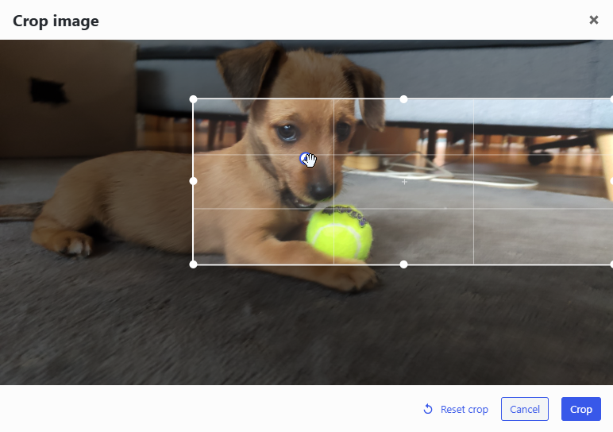

# ACF Image Aspect Ratio Crop Field (with Focus Point Editor)

[](https://github.com/joppuyo/acf-image-aspect-ratio-crop/actions/workflows/main.yml)
[](https://wordpress.org/plugins/acf-image-aspect-ratio-crop/)
[](https://wordpress.org/plugins/acf-image-aspect-ratio-crop/)
[](https://wordpress.org/plugins/acf-image-aspect-ratio-crop/#reviews)
[](https://wordpress.org/plugins/acf-image-aspect-ratio-crop/)
[](https://wordpress.org/plugins/acf-image-aspect-ratio-crop/)
[](https://wordpress.org/plugins/acf-image-aspect-ratio-crop/)
[](https://gist.github.com/cheerfulstoic/d107229326a01ff0f333a1d3476e068d)

## Fork notice

This repository is a **fork** of [joppuyo/acf-image-aspect-ratio-crop](https://github.com/joppuyo/acf-image-aspect-ratio-crop) by Johannes Siipola, taken at upstream release **v6.0.6**. The upstream plugin is still maintained for general fixes and compatibility — the author simply wasn't interested in adopting the focus point feature described below, so this fork exists to ship and maintain that one addition.

This is not presented as a replacement or a "definitive" version of the plugin; it is the upstream plugin plus the focus point editor. It is a drop-in upgrade: existing fields, crops and settings created with the original keep working untouched, and the intent is to keep merging any fixes the upstream maintainer makes going forward.

**Issues and pull requests are welcome for anything relating to the focus point feature.** For general upstream concerns (the cropping behaviour itself, WordPress / ACF compatibility and so on), [the original repository](https://github.com/joppuyo/acf-image-aspect-ratio-crop) remains the right place to raise them.

### New in this fork: focus point editor

This fork adds an optional **focus point editor** to the crop modal. When enabled on a field, a draggable dot appears inside the crop area. Wherever you place the dot is recorded as a **focus point** — percentage horizontal / vertical coordinates *within the crop rectangle* — and saved alongside the existing crop data.

The values are ready to use as a CSS `background-position` for an image rendered with `background-size: cover`: the focus point marks the important part of the photo (a face, the subject) so a container of any aspect ratio can position toward it instead of defaulting to centre.



Details:

- Stored as percentages (0–100 of the crop area) in post meta `acf_image_aspect_ratio_crop_focus_point` on the cropped attachment.
- The dot keeps its relative position while you resize or move the crop rectangle, and its saved position is restored whenever the image is re-cropped
- The feature is **opt-in per field** (a "Focus point editor" setting) and **off by default**, so behaviour is unchanged unless you enable it.
- Available for all three crop modes (aspect ratio, pixel size and free crop).

#### Using the focus point in a template

When the field's **Return Type** is *Image Array*, the focus point is appended to the returned array under a `focus_point` key:

```php
$image = get_field('hero_image'); // Return format: Image Array

if ( $image ) {
    $fp    = $image['focus_point'] ?? null;
    $pos   = $fp ? sprintf( '%s%% %s%%', $fp['left'], $fp['top'] ) : '50% 50%';
    $style = sprintf(
        'background-image: url(%s); background-size: cover; background-position: %s;',
        esc_url( $image['url'] ),
        esc_attr( $pos )
    );
    printf( '<div class="hero" style="%s"></div>', esc_attr( $style ) );
}
```

Two helper functions are also available for any attachment ID — handy when the return type is Image ID or URL:

```php
aiarc_get_focus_point( $attachment_id );   // => [ 'left' => 38.5, 'top' => 62.0 ] or null
aiarc_focus_point_style( $attachment_id ); // => "background-position: 38.5% 62%;" or ''
```

## Overview

A field for Advanced Custom Fields that forces the user to crop their image to specific aspect ratio or pixel size after uploading. Using an aspect ratio is especially useful in responsive image use cases.

After cropping, a new cropped image variant is created in the gallery and saved into the post. Thumbnails are also generated for the new image. User can re-crop the original image at any time from the post page.

The cropped image variants are hidden by default in the media browser and on the media page but you can view them by selecting the "list view" on the media page.

## Modes of operation

There are three modes of operation: aspect ratio, pixel size and free crop. You can select this option when creating the field in ACF field options.

### Aspect ratio

Use this option if you want the image to be of specific aspect ratio like 16:9 but the pixel size is not important.

After selecting an image, user can select an area from the image that matches this aspect ratio. When crop button is pressed, the area is cropped from the original image.

If you need a smaller image size, you make use of WordPress's thumbnail functionality to access a smaller version of the image.

### Pixel size

Use this option if you need a specific pixel size image like 640x480. User will not be able to select an image smaller than the defined pixel size.

After selecting an image, user can select an area from the image they want, which can be larger than the pixel size but may not be smaller. The aspect ratio of the selection is locked according to the pixel size.

When crop button is pressed, the area is cropped from the original image. After the crop is complete, the image will be automatically scaled down to the pixel size. This means the final image will always be the specified size.

### Free crop

Crop can be done freely, there are no aspect ratio limitations.

## Screenshots

### Cropping an image to 16:9 aspect ratio


### Cropping in progress


### Option to re-crop the image after upload


## Download

This fork is distributed directly from GitHub. The compiled assets in `assets/dist` are committed, so the download is ready to install without running any build step.

- **Install as a plugin zip:** on this repository, use **Code → Download ZIP**, then upload it via *Plugins → Add New → Upload Plugin* in WordPress.
- **Or clone / copy** the folder into `wp-content/plugins/acf-image-aspect-ratio-crop/`.

The upstream plugin remains available from the [WordPress plugin directory](https://wordpress.org/plugins/acf-image-aspect-ratio-crop/) and [joppuyo's GitHub releases](https://github.com/joppuyo/acf-image-aspect-ratio-crop/releases).

## Requirements

- WordPress 4.9 or later
- PHP 5.6 or later
- Advanced Custom Fields 5.8 or later (Pro or Free)

## Compatiblity

- Polylang Pro
- Enable Media Replace
- WP Offload Media, Media Cloud and other plugins that move media files to remote location

## Frequently Asked Questions

### Can I use this plugin with a front-end acf_form?

Yes, this functionality has been added in version 5.0.0. Please test it and give feedback if you encounter any issues.

### Can I access metadata in the original image from a cropped image?

Yes, the original image data is saved under `original_image` key in the returned ACF array. You can access data such as alt text, description and title this way.

### Can I use this plugin with Elementor?

No, not really. Elementor only supports built-in ACF fields. Please contact Elementor support and ask them to add support for 3rd party fields. For some workarounds for limited Elementor support, see this [post](https://wordpress.org/support/topic/excellent-plugin-5518/).

### Can I use this plugin with Beaver Builder?

No, not really. Beaver Builder only supports built-in ACF fields. Please contact Beaver Builder support and ask them to add support for 3rd party fields. However, there is a work around this limitation by using a plugin called "Toolbox For Beaver Builder". Please [see their website](https://beaverplugins.com/) for more details.

### How is this different from the other plugin?

This plugin is similar to [Advanced Custom Fields: Image Crop Add-on](https://wordpress.org/plugins/acf-image-crop-add-on/). I originally created a fork of that plugin to add functionality I need: specifying an aspect ratio instead of pixel size. Unfortunately the plugin doesn't seem to be maintained anymore so my pull request was not merged.

So I created **ACF Image Aspect Ratio Crop** from scratch as an alternative to **ACF Image Crop**.

Possibility to use a pixel size instead of aspect ratio was added later on because I got so many requests for adding that feature.

The other plugin is not actively maintained and does not work well with latest ACF versions. I try to maintain this plugin as best as I can when new versions of ACF and WordPress come out.

## Development

### Building the assets

The field's JavaScript and SCSS live in `assets/src` and are compiled with webpack into `assets/dist`. In this fork the compiled `assets/dist` output is committed so the GitHub download is directly installable — rebuild it with the steps below whenever you change files in `assets/src`.

1. Use the Node.js version in `.nvmrc` (`nvm use`).
2. Run `npm install`.
3. Run `npm run build` for a development build with source maps, or `NODE_OPTIONS=--openssl-legacy-provider npx webpack -p` for the production build the release uses.

## Thanks

Special thanks to Anders Thorborg for [ACF Image Crop](https://github.com/andersthorborg/ACF-Image-Crop) which served as a inspiration for this plugin. Also, thanks to Fengyuan Chen for the [cropper.js](https://fengyuanchen.github.io/cropperjs/) library!

## License

GPL v2 or later
